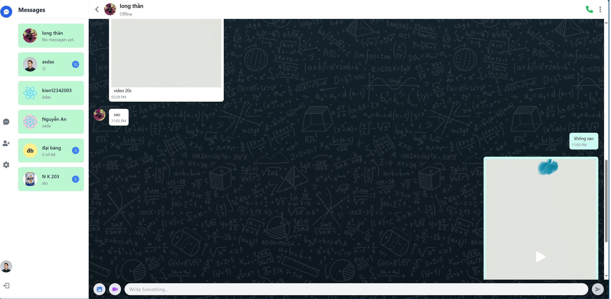
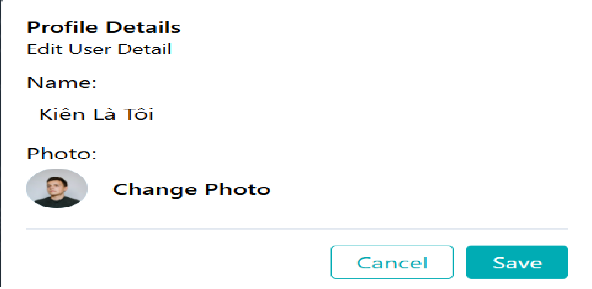
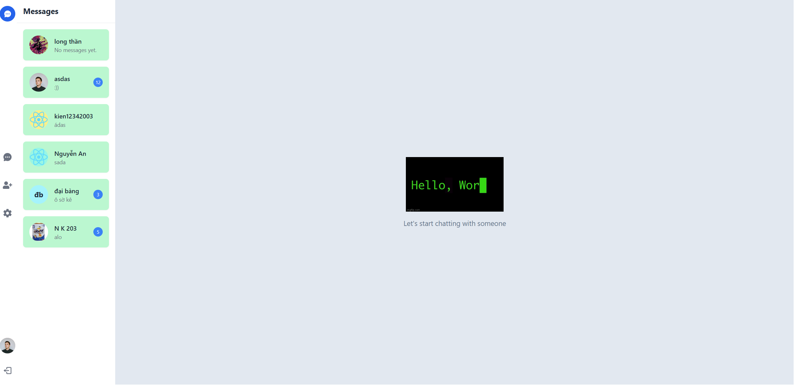
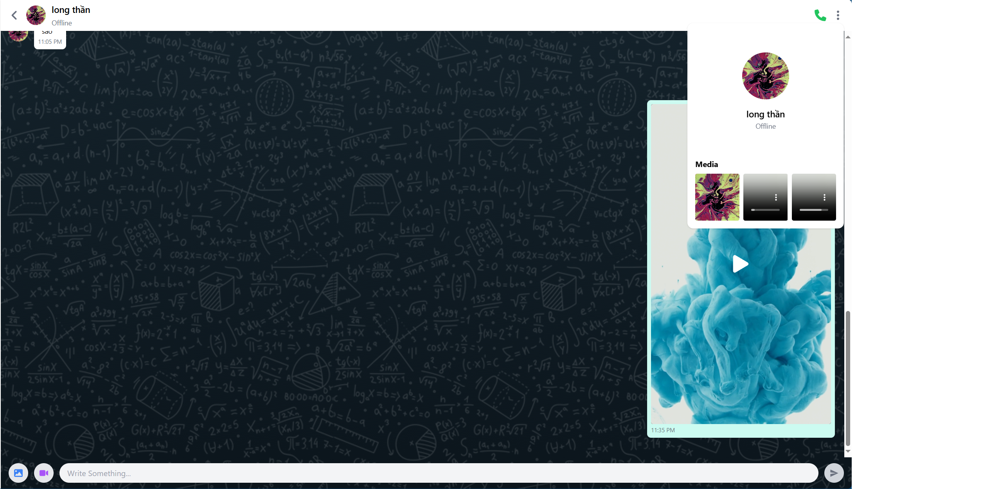
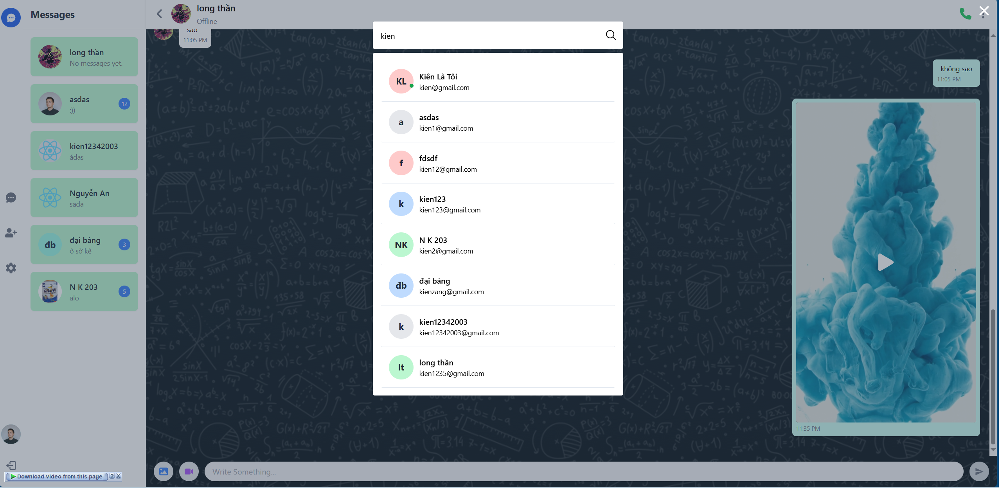
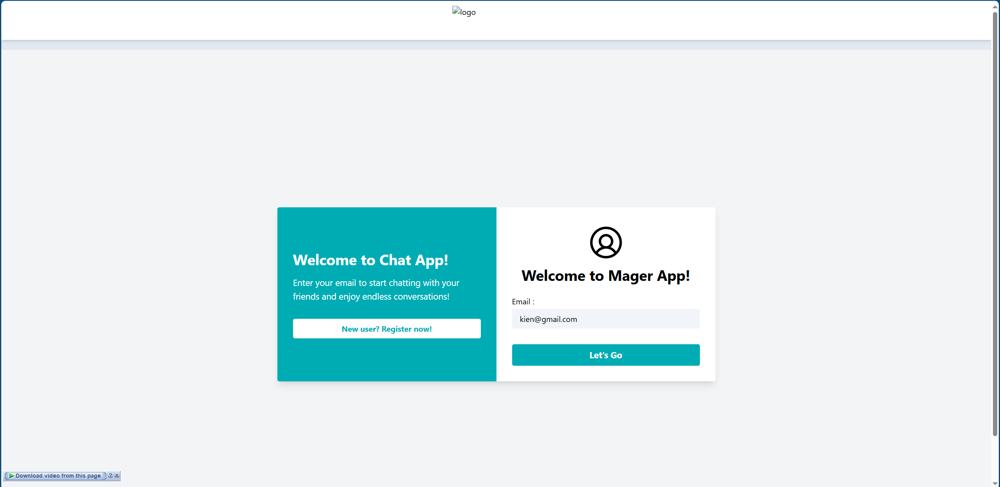
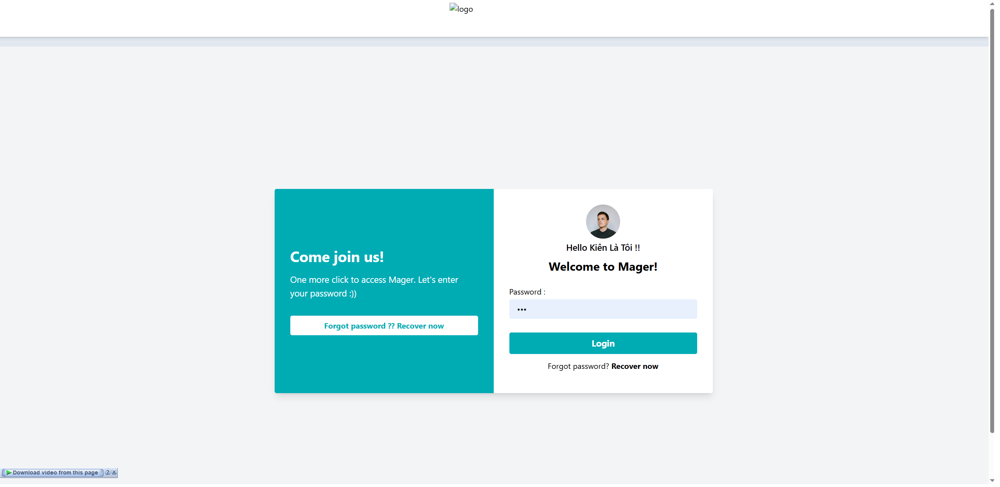
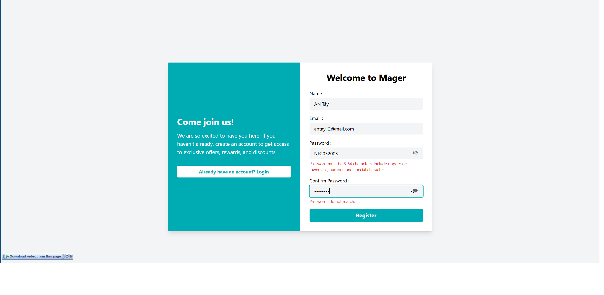

# Mager

## 👥 Team Members
- Nguyễn Xuân Kiên
- Bùi Duy Thái
- Đỗ Văn Phong

## 🛠️ Technologies Used
- **Backend (BE):** Express, NodeJS
- **Database (DB):** MongoDB
- **Frontend (FE):** React, TailwindCSS

---

## ✅ Features Completed
- [x] **Chat trực tiếp với nhau:** Người dùng có thể gửi và nhận tin nhắn trong thời gian thực.
- [x] **Trạng thái hoạt động:** Hiển thị trạng thái online/offline của người dùng.
- [x] **Lưu trữ dữ liệu:** Sử dụng MongoDB để lưu trữ thông tin người dùng và đoạn chat.
- [x] **Lưu trữ ảnh/video:** Sử dụng Cloudinary để lưu trữ tệp media (ảnh/video).
- [x] **API Authentication:** Sử dụng API để đăng nhập/đăng ký/đăng xuất/thay đổi thông tin người dùng.
- [x] **Quản lý tài khoản:** Đăng nhập, đăng ký, tìm kiếm người dùng, chỉnh sửa thông tin tài khoản.
- [x] **Xem thông tin đoạn chat:**
  - Hiển thị tên người đang chat cùng.
  - Hiển thị danh sách media đã gửi trong đoạn hội thoại.
- [x] **Ứng dụng mobile:** Xây dựng hệ thống app mobile để sử dụng đa nền tảng.
- [x] **Trình phát video tối ưu:** Video player được thiết kế lại để cải thiện trải nghiệm.
- [x] **Responsive:** Giao diện đã responsive được 70%.
- [x] **Triển khai hệ thống:** Deploy ứng dụng lên hosting để đưa vào sử dụng thực tế.

---

## ❌ Features To Be Developed
- [ ] **Gọi điện trực tiếp:** Thêm tính năng gọi thoại/video trực tiếp giữa người dùng.
- [ ] **Gửi file đính kèm:** Hỗ trợ gửi các tệp đính kèm (PDF, tài liệu, v.v.).
- [ ] **Quản lý tin nhắn:**
  - Reply tin nhắn.
  - Chuyển tiếp tin nhắn.
  - Xóa tin nhắn.
  - Xóa đoạn hội thoại.
- [ ] **Xác minh OTP:** Thêm bước xác minh OTP cho đăng ký/đăng nhập để tăng tính bảo mật và ngăn chặn spam.
- [ ] **Tối ưu giao diện:** Cải thiện thiết kế giao diện cho thân thiện và đẹp mắt hơn.
- [ ] **Tối ưu hiệu suất:** Cải thiện hiệu suất cho các chức năng hiện tại và sắp phát triển.

---

## 📸 Screenshots

### 1. Chat Interface

### 2. User Info Tab

### 3. Home Interface

### 4. Chat Info

### 5. Find User

### 6. L:ogin 1

### 7. L:ogin 2

### 8. Register

---

## 🎥 Demo Video

